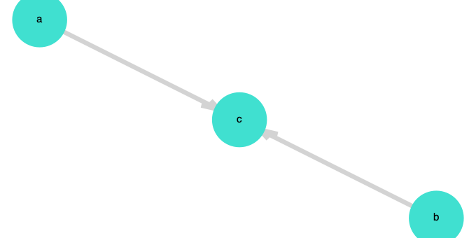
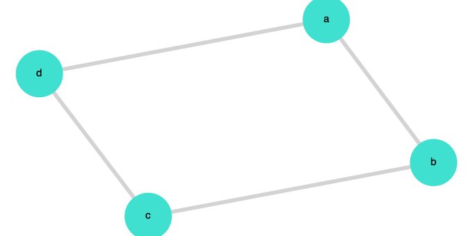
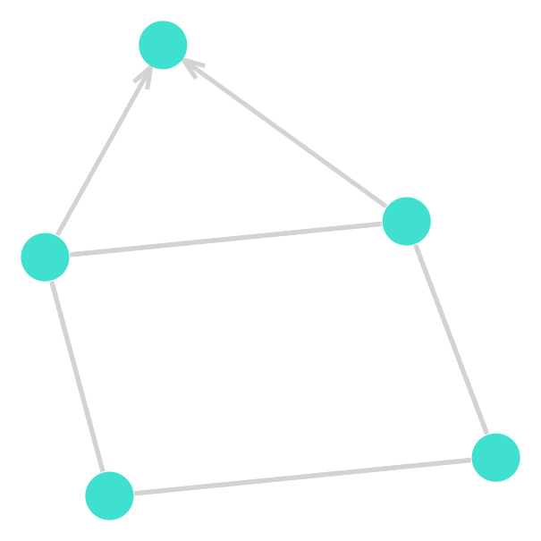

# UAI.jl


This is a Julia library accompanying the KUL course [Uncertainty in Artificial Intelligence](https://onderwijsaanbod.kuleuven.be/syllabi/e/H02D2AE.htm#activetab=doelstellingen_idp38400).

## Features

- Generating pseudo random, normalized tensors.
- Testing normalization of a tensor.
- Normalizing tensors overall.
- Normalizing tensors with a condition set.
- Plotting (factor) graphs, (Hidden) Markov Models, (di)graphical models, Bayesian Networks
- Mermaid-JS like easy, human-and-machine readable graphical model construction. e.g.:
	- c is a collider of a and b `a>c<b`
	- `a-b-c` is a linear (Markov) chain
- Get factorisation from graphical model. 
 ```Julia
    getFactorization("a<f>b")
	P(a,f,b) =
	(P(a|f)P(f)P(b|f), DiscreteVar[a, f, b])
  ```
- Mixed model (Chain Graph) representations e.g. `a-b-c; e<b>d` is a mixed model with a fork extending from b.
- Testing for graphical independence in Bayesian networks (D-seperation)
```Julia
julia> @gidp "a<c>b" a b|c
a ⫫ b | c
true
julia> @gidp "a>c<b" a b|c
a ⫫⃥ b | c
false
```
- Interactive adding of probability tables see [examples/simple.ipynb](https://github.com/KULeuven-MAI/UAI.jl/blob/master/examples/simple.ipynb)

## Installation
You can get [Julia 1.4 here](https://julialang.org/downloads/). 

You can install this library in two different ways either by forking or using the Julia build-in Pkg package manager.

### git clone project, activate, instantiate, using
```bash
git clone https://github.com/KULeuven-MAI/UAI.jl
cd UAI.jl
julia
# enter the package manager with ]
] activate .
instantiate
# back to regular Julia REPL 
<backspace>
using UAI 
# precompiled and all set for e.g. this:
drawFromStr("a>c<b", "plots/collider.png")
```

### Using Julia REPL/jupyter notebook

```Julia
import Pkg
Pkg.add(Pkg.PackageSpec(url="https://github.com/KULeuven-MAI/UAI.jl"))
using UAI
drawFromStr("a>c<b", "plots/collider.png")
```

If you're using Jupyter notebooks with the IJulia kernel you can include display the generated png simply by using the following markdown syntax:

```Markdown

``` 

## Contributing

I warmly welcome contributions. Julia is a pleasure to work with imho, increasing in popluarity, ready for high performance computing and used more and more in the Data Science community. An ideal choice to try it with this project. :)

I'm trying to write extensive tests you can run those as follows:

```Julia
git clone https://github.com/KULeuven-MAI/UAI.jl
cd UAI.jl
] test
```
If you create a PR, please make sure the test are succeeding, fix them if necessary. (But I still have some catching up to do with writing tests. See [#3](https://github.com/KULeuven-MAI/UAI.jl/issues/3))


## Plots 


### Bayesian Network - Collider

`drawFromStr("a>c<b", "plots/collider.png")`


### Bayesian Network - Fork
`drawFromStr("a<f>b", "plots/fork.png")`


### Bayesian Network - Chain
`drawFromStr("a>b>c", "plots/chain.png")`


### Markov Network - A grid with a loop 
`drawFromStr("a-b-c-d-a", "plots/grid.png")`


### Markov Network - A grid with a loop 
`drawFromStr("e<a-b-c-d>e;d-a", "plots/chainGraph.png")`


## In progress Features

- Displaying chain graphs is possible with my [GraphPlot fork](https://github.com/dietercastel/Graphplot.jl) ([until this PR](https://github.com/JuliaGraphs/GraphPlot.jl/pull/110))
- Cleaner APIs and better documentation.
- Inference with bucket elimination. 

## Wanted Features

- Inference with various algorithms: naive sum-prodcut, bucket elimination, sum-product algorithm on factor graphs, alpha/beta inference for HMMs
- Benchmark comparison of the implemented inference algorithms.
- (Full Information) Maximum Likelihood implementation for Missing At Random data.
- Tools for step-by-step probabilistic reasoning: application of definitions, Bayes rule, pushing sums down, ...
- Soft logic gates tool
- Implement Plots.jl and GraphRecipes as visual backend instead of GraphPlot.jl.
- (Interactive?) Visualization of the simplified sum-product algorithm for non-branching graphs
- (Interactive?) Visualization of the (Sum|Max)-Product algorithm
- Interactive and visualized probabilistic problem solving challenges.
- SVG support for drawFromStr() (see [#1](https://github.com/KULeuven-MAI/UAI.jl/issues/1))
- Make documentation cheatsheet corresponding to [this one here](https://github.com/KULeuven-MAI/UAI/raw/master/cheatsheet.pdf)
- **\< Your suggestion here \>**

## Nice to have features

- Multi-node support like `A,B>C` (see [#2](https://github.com/KULeuven-MAI/UAI.jl/issues/2))
- Plate notation
- Integration of [this paper](https://arxiv.org/pdf/1911.00892.pdf) and other math-visual tools
- Integration with [Probabilistic Programming Language Turing.jl](https://turing.ml/dev/docs/using-turing/get-started)?
- Accessibility (for ease of education with dyslexia, colorblindness, dyspraxia, ...)
- Displaying matrices & vectors beautifully (useful for visualizing algorithms) 
- **\< Your suggestion here \>**
