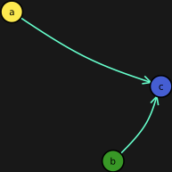
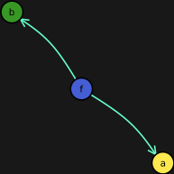
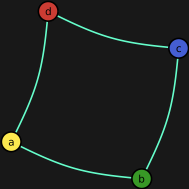

# UAI-Julia.jl

This is a Julia library accompanying the KUL course Uncertainty in Artificial Intelligence.

## Features

- Generating pseudo random, normalized tensors.
- Testing normalization of a tensor.
- Normalizing tensors overall.
- Normalizing tensors with a condition set.
- Plotting (factor) graphs, (Hidden) Markov Models, (di)graphical models, Bayesian Networks
- Mermaid-JS like easy, human-and-machine readable graphical model construction. e.g.:
	- c is a collider of a and b `a>c<b`
	- `a-b-c` is a linear (Markov) chain

## Installation
You can get [Julia 1.3 here](https://julialang.org/downloads/). 

You can install this library in two different ways either by forking or using the Julia build-in Pkg package manager.

### git clone project, activate, instantiate, using
```bash
git clone https://github.com/KULeuven-MAI/UAI.jl
cd UAI.jl
julia
# enter the package manager with ]
] activate .
instantiate
# back to regular Julia REPL 
<backspace>
using UAI 
# precompiled and all set for e.g. this:
drawFromStr("a>c<b", "plots/collider.png"
```

### Using Julia REPL/jupyter notebook

```Julia
import Pkg
Pkg.add(Pkg.PackageSpec(url="https://github.com/KULeuven-MAI/UAI.jl"))
using UAI
drawFromStr("a>c<b", "plots/collider.png"
```

If you're using Jupyter notebooks with the IJulia kernel you can include display the generated png simply by using the following markdown syntax:

```Markdown
`


### Bayesian Network - Fork
`drawFromStr("a<f>b", "plots/fork.png")`


### Bayesian Network - Chain
`drawFromStr("a>b>c", "plots/chain.png")`


### Markov Network - A grid with a loop 
`drawFromStr("a-b-c-d-a", "plots/grid.png")`


## In progress Features

- Mixed model representations e.g. `a-b-c; e<b>d` is a mixed model with a fork extending from b

## Wanted Features

- Tools for step-by-step probabilistic reasoning: application of definitions, Bayes rule, soft logic gates, ...
- (Interactive?) Visualization of the simplified sum-product algorithm for non-branching graphs
- (Interactive?) Visualization of the (Sum|Max)-Product algorithm
- Integration of [](https://arxiv.org/pdf/1911.00892.pdf) and other math-visual tools
- Interactive and visualized probabilistic problem solving challenges.
- SVG support for drawFromStr() (see [#1](https://github.com/KULeuven-MAI/UAI.jl/issues/1))
- Multi-node support like `A,B>C` (see [#2](https://github.com/KULeuven-MAI/UAI.jl/issues/2))
- Plate notation
